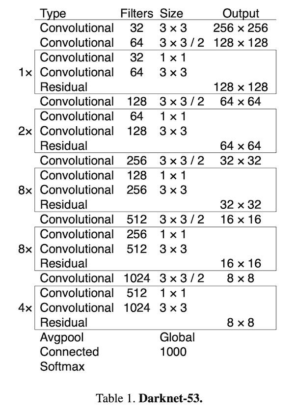
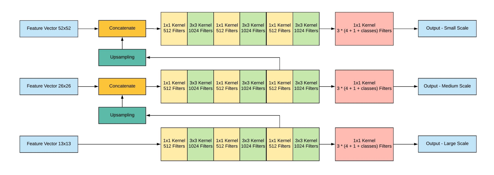

# Yolov3 Model

## Content

- [Introduction](#Introduction)
- [Data Processing](#Data-Processing)
    - [Pascal VOC](#Pascal-VOC)
- [Network Structure and Features](#Network-Structure-and-Features)
    - [DarkNet53](#DarkNet53)
    - [Multi-scale Detector](#Multi-scale-Detector)
    - [Anchor Boxes](#Anchor-Boxes)
    - [Loss Function](#Loss-Function)
- [Experiments](#Training-Experiments)
- [How To Use](#How-To-Use)

## Introduction

## Data Processing
### [VOC Dataset Preprocessing](./voc.md)

## Network Structures and Features
### DarkNet53

Darknet53 is the feature extractor/backbone of Yolov3. Darknet borrows the idea of skip connection from ResNet which let it extends from 19 layers to 53 layers.

<div align="center">
    
</div>

#### Implementation

Structure of Yolov3 model

```python
darknet53_base_cfg = [
    [   
        convblock(3, 32, 1, 1),
        convblock(3, 64, 2, 1),
        repeat_resblock([convblock(1, 32, 1, 0), convblock(3, 64, 1, 1)], 1),
        convblock(3, 128, 2, 1),
        repeat_resblock([convblock(1, 64, 1, 0), convblock(3, 128, 1, 1)], 2)
    ],
    [
        convblock(3, 256, 2, 1),
        repeat_resblock([convblock(1, 128, 1, 0), convblock(3, 256, 1, 1)], 8)
    ],
    [
        convblock(3, 512, 2, 1),
        repeat_resblock([convblock(1, 256, 1, 0), convblock(3, 512, 1, 1)], 8)
    ],
    [
        convblock(3, 1024, 2, 1),
        repeat_resblock([convblock(1, 512, 1, 0), convblock(3, 1024, 1, 1)], 4)
    ]
]
```

Then use ```make_layers``` function.

```python
class DarkNet53(nn.Module):
    def __init__(self, cfg: List[tuple]) -> None:
        super().__init__()
        self.part1 = make_layers(cfg[0], 3)
        self.part2 = make_layers(cfg[1], 128)
        self.part3 = make_layers(cfg[2], 256)
        self.part4 = make_layers(cfg[3], 512)
        
    def forward(self, x: Tensor) -> Tuple[Tensor, Tensor, Tensor]:
        x = self.part1(x)
        large = self.part2(x)
        medium = self.part3(large)
        small = self.part4(medium)
        return small, medium, large
```

Assuming the input is ```416x416```, so the output of three scale vectors from darknet would be ```13x13```,```26x26``` and ```52x52```.
- Note: If the input is different, the output size will differ too.

### Multi-scale Detector

<div align="center">
    
</div>


#### Implementation

Like above, the structure of Multi-scale Detector

```python
small_scale_cfg = [
    [repeat([convblock(1, 512, 1, 0), convblock(3, 1024, 1, 1)], 2)],
    [convblock(1, 512, 1, 0)],
    [scale()],
]

medium_scale_cfg = [
    [repeat([convblock(1, 256, 1, 0), convblock(3, 512, 1, 1)], 2)],
    [convblock(1, 256, 1, 0)],
    [scale()]
]

large_scale_cfg = [
    repeat([convblock(1, 128, 1, 0), convblock(3, 256, 1, 1)], 2),
    convblock(1, 128, 1, 0),
    scale()
]
```

```python
class Yolov3Detector(nn.Module):
    def __init__(self, num_classes: int, num_anchors: int) -> None:
        super().__init__()
        self.num_classes = num_classes
        self.num_anchors = num_anchors
        
        self.small_1 = self._make_layers(small_scale_cfg[0], 1024)
        self.small_b = self._make_layers(small_scale_cfg[1], 1024)
        self.small_2 = self._make_layers(small_scale_cfg[2], 512)
        self.upsample1 = Upsample(512, 256, kernel_size=1, stride=1)
        
        self.medium_1 = self._make_layers(medium_scale_cfg[0], 768)
        self.medium_b = self._make_layers(medium_scale_cfg[1], 512)
        self.medium_2 = self._make_layers(medium_scale_cfg[2], 256)
        self.upsample2 = Upsample(256, 128, kernel_size=1, stride=1)
        
        self.large_1 = self._make_layers(large_scale_cfg, 384)
    
    def forward(self, small: Tensor, medium: Tensor, large: Tensor) -> Tuple[Tensor, Tensor, Tensor]:
        x = self.small_1(small)
        small_branch = self.small_b(x)
        small_out = self.small_2(small_branch)
        x = self.upsample1(small_branch)
        
        x = torch.cat([x, medium], dim=1)
        x = self.medium_1(x)
        medium_branch = self.medium_b(x)
        medium_out = self.medium_2(medium_branch)
        x = self.upsample2(medium_branch)
        
        x = torch.cat([x, large], dim=1)
        large_out = self.large_1(x)
        
        return small_out, medium_out, large_out
```

### Anchor Boxes

- The goal of object detection is to get a bounding box and its class.
- Normally, bounding box are represented as a normalized xmin, ymin, xmax, ymax format. Eg, 0.5=xmin, 0.5=ymin mean the top corner of the box in the middle of the image.
- Due to the large variance of scale and aspect ratio of boxes, it's really hard for network to converge if we use this "brute force" way to get a bounding box.
- Anchor box is a prior box that have pre-defined aspect ratios
- Since Conv kernels outputs square matrix of vectors (such as ```13x13```, ```26x26```, ```52x52``` in YOLO), we define this matrix as a grid and assign anchor boxes to each cell of the grid.
- Once we defined those anchors, we can determine how much does the ground truth box overlap with the anchor box and pick the best one with the best IOU score and couple them together.
- In YOLOv3, three anchor boxes per three gird cell so we got 9 anchor boxes assigning to three scale.

> xmin, ymin, xmax, ymax:  coordinates of the box, in normalized image coordinates. xmin is in [0, 1] wher 0 is the leftmost pixel and 1, the rightmost pixel in the image. Y coordinates go from the top pixel 0 to the bottom pixel 1.

<div align="center">
    
</div>

### Loss Function

## Experiments

## How to use