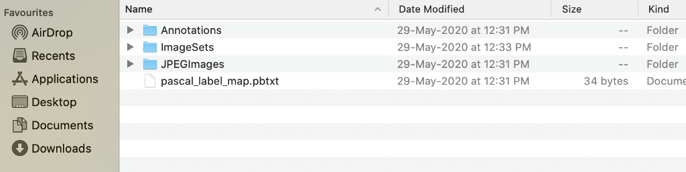

# Yolov3 Model

## Content

- [Introduction](#Introduction)
- [Data Processing](#Data-Processing)
    - [Pascal VOC](#Pascal-VOC)
- [Network Structure and Features](#Network-Structure-and-Features)
    - [DarkNet53](#DarkNet53)
    - [Implementation](#Implementation)
    - [Anchor Boxes](#Anchor-Boxes)
    - [Loss Function](#Loss-Function)
- [Experiments](#Training-Experiments)
- [How To Use](#How-To-Use)

## Introduction

## Data Processing
### Pascal VOC

PASCAL (Pattern Analysis, Statistical Modelling, and Computational Learning) is a Network of Excellence by the EU. They ran the Visual Object Challenge (VOC) from 2005 onwards till 2012.

The file structure obtained after annotations from VoTT is as below.

<div align="center">
    
</div>

The four components are Annotations, ImageSets, JPEGImages, and pascal_label_map.pbxt.

We will not prepare the dataset from scratch since torchvision provide us with ```VOCDetection``` class. So, I will override the class and adjust for the output

Our Dataset class will be composed of two main function ```__getitem__``` and ```_generate_label_matrix``` to output three scale of label matrix.

```python
# voc.py, class VOCDataset

class VOCDataset(VOCDetection):
    def __init__(
        self,
        classes: list,
        anchor_boxes: list,
        root: str = './datasets',
        year: str = '2012',
        image_set: str = 'train',
        download: bool = False,
        transforms: Optional[Callable] = None,
        num_classes: int = 20,
    ) -> None:
        super().__init__(root, year, image_set, download)
        self.classes = classes
        self.num_classes = len(classes)
        self.transforms = transforms
        self.anchor_boxes = torch.tensor(anchor_boxes)
        
    def _generate_label_matrix(self, S, boxes, class_labels, anchor_boxes):
        # ... line 47
        return label_matrix
            
             
    def __getitem__(self, index):
        # ... line 33
        return image, (small_label_matrix, medium_label_matrix, large_label_matrix)
```
--text--
```python
# voc.py, class VOCDataset

def __getitem__(self, index):
    image = Image.open(self.images[index]).convert("RGB")
    
    root_ = ET.parse(self.annotations[index]).getroot()
    targets = []
    for obj in root_.iter("object"):
        target = []
        target.append(VOC_CLASSES.index(obj.find("name").text))
        bbox = obj.find('bndbox')
        for xyxy in ("xmin", "ymin", "xmax", "ymax"):
            target.append(int(bbox.find(xyxy).text))
        targets.append(target)
    targets = torch.tensor(targets)
    image = np.array(image)
```
--text--
```python
# voc.py, class VOCDataset

if self.transforms:
    output_labels_list = targets[:, 0].int().tolist()
    if type(output_labels_list) == str:
        output_labels_list = [output_labels_list]
    transformed_items = self.transforms(
        image=image, bboxes=targets[:, 1:], class_labels=output_labels_list
    )
    image = transformed_items["image"]
    boxes = transformed_items["bboxes"]
    class_labels = transformed_items["class_labels"]
```
For three scale, we will generate 13, 26 and 52 scale of label matrix
```python
# voc.py, class VOCDataset

small_label_matrix = self._generate_label_matrix(
    13, boxes, class_labels, copy.deepcopy(self.anchor_boxes)[2] / (416 / 13)
)
medium_label_matrix = self._generate_label_matrix(
    26, boxes, class_labels, copy.deepcopy(self.anchor_boxes)[1] / (416 / 26)
)
large_label_matrix = self._generate_label_matrix(
    52, boxes, class_labels, copy.deepcopy(self.anchor_boxes)[0] / (416 / 52)
)
```
--text--
```python
# voc.py, class VOCDataset

from torchvision.ops.boxes import box_iou

def _generate_label_matrix(self, S, boxes, class_labels, anchor_boxes):
    for box, class_label in zip(boxes, class_labels):
        xmin, ymin, xmax, ymax = box
        
        x = xmin / 416
        y = ymin / 416
        w = (xmax - xmin) / 416
        h = (ymax - ymin) / 416
        
        # Assign gird cell of i, j
        i, j = int(S * x), int(S * y)
        
        x_cell, y_cell = S * x - i, S * y - j

        anchor_boxes[:, 0] = xmin
        anchor_boxes[:, 1] = ymin
        anchor_boxes[:, 2] = xmin + anchor_boxes[:, 2] / 2
        anchor_boxes[:, 3] = ymin + anchor_boxes[:, 3] / 2

        width_cell, height_cell = (w * S, h * S)
        
        ious = box_iou(
            anchor_boxes,
            torch.tensor([xmin, ymin, xmax, ymax]).unsqueeze(0).float()
        )
        
        _, max_idx = ious.max(0)
        
        box_coordinate = torch.tensor([x_cell, y_cell, width_cell, height_cell])
```
--text--
```python
# voc.py, class VOCDataset

def _generate_label_matrix(self, S, boxes, class_labels, anchor_boxes):
    label_matrix = torch.zeros(
        (S, S, len(anchor_boxes), 5 + self.num_classes), dtype=torch.float64
    )

    # ... line 26

        # set box_coordinate
        label_matrix[j, i, max_idx[0], :4] = box_coordinate
        # set confidence score
        label_matrix[j, i, max_idx[0], 4] = 1
        # set one hot coding for class label
        label_matrix[j, i, max_idx[0], 5 + class_label] = 1
    
    return label_matrix
```

> Check for detail [code](https://github.com/DavianYang/yolo.ai/blob/main/yolo/datasets/voc.py)

## Network Structures and Features
### DarkNet53

Darknet53 is the feature extractor/backbone of Yolov3. Darknet borrows the idea of skip connection from ResNet which let it extends from 19 layers to 53 layers.

<div align="center">
    
</div>

#### Implementation

Structure of Yolov3 model

```python
darknet53_base_cfg = [
    [   
        convblock(3, 32, 1, 1),
        convblock(3, 64, 2, 1),
        repeat_resblock([convblock(1, 32, 1, 0), convblock(3, 64, 1, 1)], 1),
        convblock(3, 128, 2, 1),
        repeat_resblock([convblock(1, 64, 1, 0), convblock(3, 128, 1, 1)], 2)
    ],
    [
        convblock(3, 256, 2, 1),
        repeat_resblock([convblock(1, 128, 1, 0), convblock(3, 256, 1, 1)], 8)
    ],
    [
        convblock(3, 512, 2, 1),
        repeat_resblock([convblock(1, 256, 1, 0), convblock(3, 512, 1, 1)], 8)
    ],
    [
        convblock(3, 1024, 2, 1),
        repeat_resblock([convblock(1, 512, 1, 0), convblock(3, 1024, 1, 1)], 4)
    ]
]
```

Then use ```make_layers``` function.

```python
class DarkNet53(nn.Module):
    def __init__(self, cfg: List[tuple]) -> None:
        super().__init__()
        self.part1 = make_layers(cfg[0], 3)
        self.part2 = make_layers(cfg[1], 128)
        self.part3 = make_layers(cfg[2], 256)
        self.part4 = make_layers(cfg[3], 512)
        
    def forward(self, x: Tensor) -> Tuple[Tensor, Tensor, Tensor]:
        x = self.part1(x)
        large = self.part2(x)
        medium = self.part3(large)
        small = self.part4(medium)
        return small, medium, large
```

Assuming the input is ```416x416```, so the output of three scale vectors from darknet would be ```13x13```,```26x26``` and ```52x52```.
- Note: If the input is different, the output size will differ too.

### Multi-scale Detector

<div align="center">
    
</div>


#### Implementation

Like above, the structure of Multi-scale Detector

```python
small_scale_cfg = [
    [repeat([convblock(1, 512, 1, 0), convblock(3, 1024, 1, 1)], 2)],
    [convblock(1, 512, 1, 0)],
    [scale()],
]

medium_scale_cfg = [
    [repeat([convblock(1, 256, 1, 0), convblock(3, 512, 1, 1)], 2)],
    [convblock(1, 256, 1, 0)],
    [scale()]
]

large_scale_cfg = [
    repeat([convblock(1, 128, 1, 0), convblock(3, 256, 1, 1)], 2),
    convblock(1, 128, 1, 0),
    scale()
]
```

```python
class Yolov3Detector(nn.Module):
    def __init__(self, num_classes: int, num_anchors: int) -> None:
        super().__init__()
        self.num_classes = num_classes
        self.num_anchors = num_anchors
        
        self.small_1 = self._make_layers(small_scale_cfg[0], 1024)
        self.small_b = self._make_layers(small_scale_cfg[1], 1024)
        self.small_2 = self._make_layers(small_scale_cfg[2], 512)
        self.upsample1 = Upsample(512, 256, kernel_size=1, stride=1)
        
        self.medium_1 = self._make_layers(medium_scale_cfg[0], 768)
        self.medium_b = self._make_layers(medium_scale_cfg[1], 512)
        self.medium_2 = self._make_layers(medium_scale_cfg[2], 256)
        self.upsample2 = Upsample(256, 128, kernel_size=1, stride=1)
        
        self.large_1 = self._make_layers(large_scale_cfg, 384)
    
    def forward(self, small: Tensor, medium: Tensor, large: Tensor) -> Tuple[Tensor, Tensor, Tensor]:
        x = self.small_1(small)
        small_branch = self.small_b(x)
        small_out = self.small_2(small_branch)
        x = self.upsample1(small_branch)
        
        x = torch.cat([x, medium], dim=1)
        x = self.medium_1(x)
        medium_branch = self.medium_b(x)
        medium_out = self.medium_2(medium_branch)
        x = self.upsample2(medium_branch)
        
        x = torch.cat([x, large], dim=1)
        large_out = self.large_1(x)
        
        return small_out, medium_out, large_out
```

### Anchor Boxes

- The goal of object detection is to get a bounding box and its class.
- Normally, bounding box are represented as a normalized xmin, ymin, xmax, ymax format. Eg, 0.5=xmin, 0.5=ymin mean the top corner of the box in the middle of the image.
- Due to the large variance of scale and aspect ratio of boxes, it's really hard for network to converge if we use this "brute force" way to get a bounding box.
- Anchor box is a prior box that have pre-defined aspect ratios
- Since Conv kernels outputs square matrix of vectors (such as ```13x13```, ```26x26```, ```52x52``` in YOLO), we define this matrix as a grid and assign anchor boxes to each cell of the grid.
- Once we defined those anchors, we can determine how much does the ground truth box overlap with the anchor box and pick the best one with the best IOU score and couple them together.
- In YOLOv3, three anchor boxes per three gird cell so we got 9 anchor boxes assigning to three scale.

> xmin, ymin, xmax, ymax:  coordinates of the box, in normalized image coordinates. xmin is in [0, 1] wher 0 is the leftmost pixel and 1, the rightmost pixel in the image. Y coordinates go from the top pixel 0 to the bottom pixel 1.

### Loss Function

## Experiments

## How to use