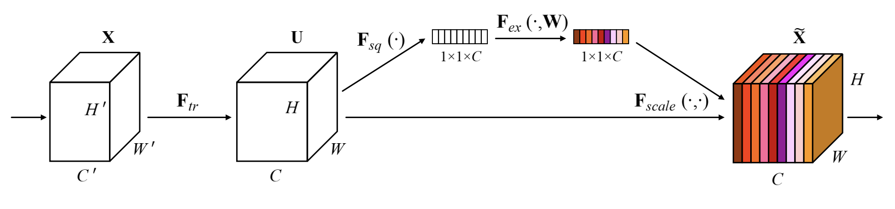

# Modules

## Content
- [Squeeze And Excitation](Squeeze-And-Excitation)

## Squeeze And Excitation
#### (Image Model Blocks)
<div align="center">
    
</div>

- Given convolutional block as an input.
- Each channel is "squeezed" into a single numeric value using average pooling.
```H x W x C-> 1 x 1 x C```
- Two convolutional layer followed by SiLU which give smooth and non-monotonic attribute. Which give as
```1 x 1 x C -> [0, 1]```
- This way, the network knows which channels should be prioritized. Eg. 0.1 give 10% of.
> Swish/SiLU outperforms ReLU by a large margin in the range between 40 and 50 layers when optimization becomes difficult.
Check details of SiLU for [here](https://medium.com/@neuralnets/swish-activation-function-by-google-53e1ea86f820)
